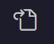

# Installfest


## Homebrew

[Homebrew](https://brew.sh/) is an extremely popular and easy to use package manager for macOS. This is the tool we will use to install all of the software we need for this course.

Install homebrew from the command line with the command:

```shell
/usr/bin/ruby -e "$(curl -fsSL https://raw.githubusercontent.com/Homebrew/install/master/install)"
```

This install script will tell you the files it will create and ask for your password. **YOUR PASSWORD WILL NOT DISPLAY**, just keep typing.

After the install, you should see this printed in your terminal:

```shell
==> Installation successful!

==> Homebrew has enabled anonymous aggregate formulae and cask analytics.
Read the analytics documentation (and how to opt-out) here:
  https://docs.brew.sh/Analytics

==> Homebrew is run entirely by unpaid volunteers. Please consider donating:
  https://github.com/Homebrew/brew#donations
==> Next steps:
- Run `brew help` to get started
- Further documentation: 
    https://docs.brew.sh
```


### Oh-My-Zsh!

This one is an optional choice

Now we will introduce a more developer friendly terminal environment or "shell".

Open the `Terminal` app and type the following two commands (Hit `<Enter>` after each):
```
brew install zsh zsh-completions
```

Verify installation by running `zsh --version`. Expected result: zsh 5.1.1 or more recent.

Install oh-my-zsh 
```
sh -c "$(curl -fsSL https://raw.githubusercontent.com/robbyrussell/oh-my-zsh/master/tools/install.sh)"
```

Close and reopen your terminal app again to use your new default shell.
Test that it worked with 
```echo $SHELL```
Expected result: /bin/zsh or similar.


### Git
Let's install `git` and a nifty helper for viewing files in the command line, `tree`.


```
brew install git
brew install tree
```

### Node.js

Finally, we will set up a runtime for using javascript from the terminal.

You can install nvm with the following terminal command:
Copying + pasting this is strongly recommended.


```
curl -o- https://raw.githubusercontent.com/nvm-sh/nvm/v0.34.0/install.sh | bash
```

Ensure that node is installed with the following commands.

```
nvm install 12.9.1
```

### VS Code

```
brew cask install visual-studio-code
```

Open VS Code by typing `code` at the terminal.

Type `Command + comma` and click this icon  on the top right to open the `settings.json` config file.

Copy and paste the options from below and save:
```
{
  "window.zoomLevel": 3,
  "workbench.startupEditor": "newUntitledFile",
  "workbench.colorTheme": "Visual Studio Dark",
  "editor.formatOnSave": true,
  "editor.formatOnType": true,
    "rules": {
      "no-unused-vars": "off",
      "arrow-body-style": "off",
      "no-debugger": "off",
      "eol-last": "off",
      "react/jsx-one-expression-per-line": "off"
  },
  "explorer.confirmDragAndDrop": false,
  "javascript.updateImportsOnFileMove.enabled": "always",
  "explorer.confirmDelete": false,
  "workbench.activityBar.visible": true,
  "explorer.openEditors.visible": 0,
  "workbench.statusBar.feedback.visible": false,
  "terminal.integrated.rendererType": "dom",
  "editor.tabSize": 2,
  "editor.detectIndentation": false,
}
```

now install these
```
npm install -g eslint-config-airbnb-base eslint eslint-plugin-jsx-a11y eslint-plugin-import eslint-plugin-react

```


